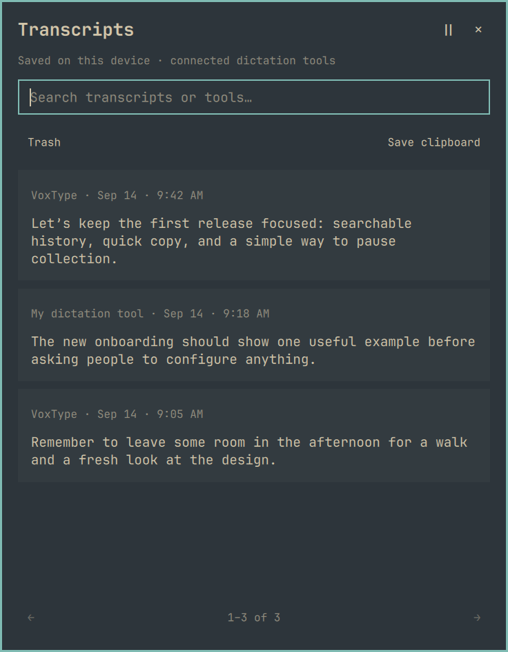

# Transcripts for Omarchy

Keep your dictated words in one place. Transcripts is a native Omarchy bar plugin
that saves a local, searchable history from connected speech-to-text tools, so you
can find and copy something you said even after it has left your dictation tool.

VoxType is the first documented integration. Other tools can feed the same history
through an output hook, command pipeline, or adapter. Connecting a tool is a
separate step after installation; the plugin does not automatically detect all
dictation on your system.

This is an early personal project, shared publicly for others to use and adapt.
**Pull requests and outside contributions are not being accepted at this time.**
See [Contributing](https://github.com/davefano/omarchy-transcripts/blob/main/CONTRIBUTING.md)
for the current policy.



## Features

- Search transcript text and tool names in one history.
- Copy directly from a transcript row, or open the full text.
- Pause and resume collection without interrupting dictation.
- Move entries to recoverable Trash and restore them later.
- Export saved history as JSON.
- Save clipboard text manually when a tool has no integration.

Hover over a transcript to copy it directly from the history list or open its
full text using the icons at the top right of the entry. The same actions appear
when navigating the list with the keyboard; use Tab to focus an icon and Enter
or Space to activate it. Copy keeps you in the list.
Incoming entries wait while you hover over or navigate the list, so rows do not
move beneath the copy action. Move the pointer and keyboard focus outside the list
to resume updates.

## Install

Requires Omarchy's plugin-capable Quickshell shell, Python 3.11+, `wl-clipboard`,
and Git to clone the repository. Older Waybar-based Omarchy versions are not
supported.

```bash
omarchy plugin add https://github.com/davefano/omarchy-transcripts.git --enable
bash ~/.config/omarchy/plugins/io.github.davefano.transcripts/install.sh --cli-only
```

The first command installs and enables the panel. The second creates
`~/.local/bin/omarchy-transcripts`, a symlink to the installed Python collector.
**This manual setup step is required for the command examples and dictation hooks
below:** Omarchy's plugin installer does not execute `install.sh` automatically.
The panel itself can display history and save clipboard text without the launcher.

No root access or background daemon is needed. The setup script refuses to replace
an unrelated command. It does not install dependencies or change your speech tool's
configuration. Python 3.11+, `wl-copy`, and `wl-paste` must already be available.
Collection starts only after you connect a speech tool below.

Installed plugin: `~/.config/omarchy/plugins/io.github.davefano.transcripts/`.
Command: `~/.local/bin/omarchy-transcripts`.
Open from a terminal with `omarchy-transcripts open`.

### Update

```bash
omarchy plugin update io.github.davefano.transcripts
```

The launcher follows the installed collector, so it does not need recreating
after an update. Source-based installations made with `bash install.sh` are copies,
not Git checkouts; update those by rerunning the installer from your source repo.

### Upgrade from `local.transcripts`

Install the new plugin, then explicitly migrate the collector launcher and disable
the old bar entry:

```bash
omarchy plugin add https://github.com/davefano/omarchy-transcripts.git --enable
bash ~/.config/omarchy/plugins/io.github.davefano.transcripts/install.sh --cli-only --migrate
```

The database stays at `~/.local/share/omarchy-transcripts/history.sqlite3`.
Existing hooks using `~/.local/bin/omarchy-transcripts` keep working. Hooks pointing
directly into the old plugin folder must be updated to the launcher path.
The migration preserves the old plugin files. Once you have checked the new panel
and dictation capture, remove the old plugin with `omarchy plugin remove local.transcripts`.

If you previously copied this plugin manually using its new ID, `plugin add` will
refuse the duplicate. Disconnect the hook first, remove the existing plugin through
`omarchy plugin remove io.github.davefano.transcripts`, then use the installation
commands above and reconnect the hook. Saved history is preserved.

## Connect VoxType

VoxType's documented post-processing hook runs after recognition and before output:
https://voxtype.io/docs/CONFIGURATION#outputpost_process

Add this table to `~/.config/voxtype/config.toml`, replacing the path with your own
home directory's absolute path:

```toml
[output.post_process]
command = "/home/YOUR_USER/.local/bin/omarchy-transcripts ingest --source VoxType --passthrough"
timeout_ms = 2000
```

Restart VoxType when it is idle: `systemctl --user restart voxtype`.
The hook returns its input unchanged. A storage error still returns the original
text so dictation can continue. Copy/paste, typing mode, and engine selection stay
with VoxType. The history contains recognized text even if delivery to an app fails.

If a post-processing hook already exists, append this collector **after** the
existing processor rather than replacing it. Profiles with their own post-process
commands also need the collector appended. Streaming tools may invoke their hook
per segment; this first version saves each invocation as a separate entry.

## Connect other tools

The store is independent of the recognition tool. Send each completed transcript
as UTF-8 on standard input:

```bash
your-transcriber | omarchy-transcripts ingest --source "My dictation tool" --passthrough
```

Use `--passthrough` when another step needs to receive the same text. Omit it when
the producer only needs to log text. Source labels are freely chosen. Repeated
dictations are preserved as separate entries.

There is no universal OS event identifying "this text was dictated." Automatic
collection requires a tool's output hook, command output, or an adapter. Apps with
only simulated typing and no readable output need a separate integration. This
plugin does not record keystrokes or monitor every clipboard change. The panel's
**Save clipboard** action explicitly saves the current text once, labelled
"Clipboard (manual)". It is a fallback, not automatic tool detection.

## Data and privacy

Text, source, and UTC timestamp are stored in
`~/.local/share/omarchy-transcripts/history.sqlite3`. The panel displays local time.
`XDG_DATA_HOME` is supported. The directory is user-only (0700), and the database
is user-only (0600). This is ordinary unencrypted local storage, not a vault.
No audio, application contents, passwords from unrelated clipboard activity, or
network requests are collected. Connected tools can still dictate sensitive text;
use Pause when you do not want it retained.

Entries are retained indefinitely. Trash is recoverable and still occupies the
database; it is not secure deletion. Export excludes Trash:

```bash
omarchy-transcripts export > transcripts.json
omarchy-transcripts list --query "meeting"
omarchy-transcripts get 42
omarchy-transcripts pause
omarchy-transcripts resume
```

List returns JSON with pagination (`--limit 50 --offset 50`). Search is literal,
with ASCII case-insensitive matching; non-ASCII text matches exactly. SQL syntax
and shell metacharacters in transcripts are treated as ordinary data.
For searches starting with a dash, use `--query=--help` (an attached value).

The panel uses `list --page-only`, which fetches one extra row to report `has_more`
without counting the full history on every refresh. In this mode, `total` is
`null` until the last page; the panel shows the visible range and enables Next
when more entries exist. Ordinary `list` still returns an exact total. If entries
are removed from the last page, `offset` moves back to the last available page.

## Disable or remove

To stop collection, remove the collector from each dictation tool's hook and restart
that tool when it is idle. Preserve any other post-processors. Disabling the panel
alone does not stop hooks from collecting text.

To hide just the panel:

```bash
omarchy plugin disable io.github.davefano.transcripts
```

To uninstall, disconnect the hooks first, then remove the panel and its launcher:

```bash
omarchy plugin remove io.github.davefano.transcripts
# Remove only the symlink owned by this plugin, even if its target is now absent.
if [ "$(readlink -- "$HOME/.local/bin/omarchy-transcripts")" = "$HOME/.config/omarchy/plugins/io.github.davefano.transcripts/transcripts.py" ]; then
  unlink "$HOME/.local/bin/omarchy-transcripts"
fi
```

For a source installation using a custom `XDG_CONFIG_HOME`, substitute that config
path in the launcher check. Omarchy's standard plugin commands use `~/.config`.
If you migrated from `local.transcripts`, remove that disabled plugin too.

Uninstalling preserves saved history. To retain a portable copy, run
`omarchy-transcripts export > transcripts.json` before removing the launcher.
History can contain sensitive text; choose a private location for exports.

## Development

```bash
python3 -m unittest -v test_transcripts.py test_install.py
omarchy plugin validate .
bash test_panel.sh
bash install.sh  # use --migrate if the legacy plugin is still installed
```

Tests use temporary storage and never read or alter your real history. To manually
test with an isolated store, set `OMARCHY_TRANSCRIPTS_DIR` for the CLI process.
The installed plugin and this source directory are separate. The installer copies
source files and enables the widget before the audio icon. For an existing Git-managed
installation, it refuses to overwrite the checkout from another source directory;
update that checkout instead. `--cli-only` creates the launcher without changing
bar placement. Installer tests use a temporary home and stub Omarchy IPC commands.
The panel tests require an active Omarchy graphical session and Qt's QML Test
module. They open a separate panel, exercise mouse and keyboard interactions,
and use a fake clipboard command so your clipboard remains untouched.

## Project status and contributions

Maintained by [David Fano](https://github.com/davefano) as a personal project.
There is no promised support or release schedule. You are welcome to use the
project and maintain your own fork under its license, but please do not submit
pull requests or patches to this repository. See
[CONTRIBUTING.md](https://github.com/davefano/omarchy-transcripts/blob/main/CONTRIBUTING.md).

## License

[MIT](LICENSE). Copyright (c) 2026 David Fano.
